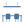
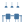

[](https://github.com/hacs/integration)
[](https://github.com/elax46/custom-brand-icons/releases/latest)
[![CC BY-NC-SA 4.0][cc-by-nc-sa-shield]][cc-by-nc-sa]


[cc-by-nc-sa]: http://creativecommons.org/licenses/by-nc-sa/4.0/
[cc-by-nc-sa-image]: https://licensebuttons.net/l/by-nc-sa/4.0/88x31.png
[cc-by-nc-sa-shield]: https://img.shields.io/badge/License-CC%20BY--NC--SA%204.0-lightgrey.svg

# Custom brand icons


#### Custom brand icons use the prefix `phu:`
#### Append Name (of the icon) after `phu:`
- Example: `phu:eggs` 
- Example: `phu:chicken` 

### Make sure to [install](#installation-methods) `custom-brand-icons.js` into `configuration.yaml` or `ui-lovelace.yaml`


## Iconify

All icons are available in the [framework Iconify](https://github.com/iconify). You can use icons using the prefix `cbi`. Anyone who uses this icon set via the framework is reminded to comply with the license. For commercial purposes you can contact us

- For all information  visit the website https://iconify.design
- For use visit https://iconify.design/docs/usage/
- Browse Icons  https://icon-sets.iconify.design/cbi/


## Index


- [Custom brand icons](#custom-brand-icons)
      - [Custom brand icons use the prefix `phu:`](#custom-brand-icons-use-the-prefix-phu)
      - [Append Name (of the icon) after `phu:`](#append-name-of-the-icon-after-phu)
    - [Make sure to install `custom-brand-icons.js` into `configuration.yaml` or `ui-lovelace.yaml`](#make-sure-to-install-custom-brand-iconsjs-into-configurationyaml-or-ui-lovelaceyaml)
  - [Index](#index)
- [Icons Available](#icons-available)
    - [Alexa](#alexa)
    - [Apple](#apple)
    - [Aqara](#aqara)
    - [Battery Status](#battery-status)
    - [Blink Cameras](#blink-cameras)
    - [Car Manufacturers](#car-manufacturers)
    - [Christmas Decorations](#christmas-decorations)
    - [Doors](#doors)
    - [Duco Ventilation](#duco-ventilation)
    - [Dyson](#dyson)
    - [Elgato](#elgato)
    - [Eufy](#eufy)
    - [Fritz](#fritz)
    - [Garbage Collection](#garbage-collection)
    - [Google](#google)
    - [Govee](#govee)
    - [HA Addons](#ha-addons)
    - [House Rooms](#house-rooms)
    - [IKEA](#ikea)
    - [LG](#lg)
    - [Meross](#meross)
    - [Miscellany of Icons](#miscellany-of-icons)
    - [Modem/Router ISP](#modemrouter-isp)
    - [Moes](#moes)
    - [Netgear](#netgear)
    - [Networking](#networking)
    - [Philips Hue Official](#philips-hue-official)
    - [Philips Hue Custom](#philips-hue-custom)
    - [Reolink](#reolink)
    - [Ring](#ring)
    - [Roku](#roku)
    - [Schneider Electric](#schneider-electric)
    - [Shutter Percentage of Opening](#shutter-percentage-of-opening)
    - [Sonoff](#sonoff)
    - [Sonos](#sonos)
    - [Stage DMX Lights](#stage-dmx-lights)
    - [Tesla](#tesla)
    - [Television](#television)
    - [TP-Link](#tp-link)
    - [Ubiquiti](#ubiquiti)
    - [Umage Lamps](#umage-lamps)
    - [Pedastal](#pedastal)
    - [Window and Roller Shutter](#window-and-roller-shutter)
    - [Vacuum Parts](#vacuum-parts)
    - [Delivery Services](#delivery-services)
    - [Bose](#bose)
    - [Solar](#solar)
    - [Video Game Systems](#video-game-systems)
    - [Cryptocurrency](#cryptocurrency)
    - [Yeelight](#yeelight)
    - [SleepIQ / SleepNumber](#sleepiq--sleepnumber)
- [Installation Methods](#installation-methods)
      - [HACS](#hacs)
      - [Manual Installation](#manual-installation)
- [User Manual](#user-manual)
      - [Custom brand icons use the prefix `phu:`](#custom-brand-icons-use-the-prefix-phu-1)
      - [Append Name (of the icon) after `phu:`](#append-name-of-the-icon-after-phu-1)
- [Don't see the icon?](#dont-see-the-icon)
      - [Hard Reload (browser cache issue)](#hard-reload-browser-cache-issue)
      - [Redownload Integration](#redownload-integration)
      - [Reinstall Integration](#reinstall-integration)
- [Icon Requests](#icon-requests)
- [Thanks for your support](#thanks-for-your-support)
  - [StarGazers](#stargazers)
- [Developer Workflow](#developer-workflow)
    - [Make your own `svg` icon](#make-your-own-svg-icon)
    - [Modify `custom-brand-icons.js` file](#modify-custom-brand-iconsjs-file)
    - [Update `README.md`](#update-readmemd)
    - [Contributions and Pull Requests](#contributions-and-pull-requests)
---

# Icons Available

---

### Alexa

| Icon | Name | Icon | Name |
| :--- | :--- | :--- | :--- |
|  | echo-dot-4-group |  | echo-dot-gen-3 |
|  | echo-dot-gen-4-clock |  | echo-dot-gen-4 |
|  | echo-gen-2 |  | echo-plus |
|  | echo-show-5-gen-2 |  | echo-show-5-group |
|  | echo-show-8-gen-2 |  | echo-show-8-group |
|  | echo-spot |  | echo-show-15 |
|  | echo-studio-2nd |  | echo-show-10 |   |echo-pop| 
|   | echo-flex |

---

### Apple

| Icon | Name | Icon | Name |
| :--- | :--- | :--- | :--- |
|  | apple-airpods-pro |  | apple-airpods |
|  | apple-ipad-pro |  | apple-iphone |
|  | apple-tv-box |  | apple-tv |
|  | apple-watch-alt |  | apple-watch |
|  | apple-tv-gen2-remote |  | homekit |
|  | homepod |  | homepod-mini |
|  | imac | | |

---

### Aqara

Icons made by [@rchiileea](https://github.com/rchiileea)

| Icon | Name | Icon | Name |
| :--- | :--- | :--- | :--- |
|  | aqara-air-quality |  | aqara-cube |
|  | aqara-fp1 |  | aqara-g2-pro |
|  | aqara-g3 |  | aqara-gas-detector |
|  | aqara-h1-switch |  | aqara-hub-n15-g2 |
|  | aqara-opple |  | aqara-pet-feeder-c1 |
|  | aqara-smoke-detector |  | aqara-curtain |
|  | aqara-contact |  | aqara-inwall |
|  | aqara-motion |  | aqara-temperature |
|  | aqara-vibration |  | aqara-waterleak
|  | aqara-dw-p2 |  | aqara-g4
|  | aqara-t1 |  | aqara-wirelessbutton
|  | aqara-e1 |  | aqara-m3 |
 | aqara-symphony-t1 |  | aqara-thermo-e1 |
 | aqara-z1-pro-1 |  | aqara-z1-pro-2 |
 | aqara-z1-pro-3 |  | aqara-z1-pro-4 |
|  | aqara-a100 |[Preview](/icon-svg/aqara-n100.svg) | aqara-n100 |
|  | aqara-u100 |

---

### Battery Status

| Icon | Name | Icon | Name |
| :--- | :--- | :--- | :--- |
|  | battery-charged |  | battery-critical |
|  | battery-full |  | battery-good |
|  | battery-half |  | battery-low |

---

### Blink Cameras

| Icon | Name | Icon | Name |
| :--- | :--- | :--- | :--- |
|  | mini-camera |  | sync-module |
|  | xt2-camera |

---

### Car Manufacturers

Icons made by [@rchiileea](https://github.com/rchiileea)

| Icon | Name | Icon | Name |
| :--- | :--- | :--- | :--- |
|  | abarth |  | alfa-romeo |
|  | audi |  | chrysler |
|  | citroen |  | dodge |
|  | ds |  | fiat |
|  | ford |  | honda |
|  | hyundai |  | hyundai-alt
|  | jeep |  | kia |  | lancia |
|  | nissan |  | opel |
|  | peugeot-alt |  | peugeot |
|  | porsche |  | ram |
|  | toyota |  | vauxhall |
|  | volkswagen |  | renault |
|  | renault-invert |  | bmw |
|  | bmw-alt |  | volvo |
|  | volvo-alt |  | acura |
|  | aston-martin |  | bentley |
|  | bugatti |  | byd |
|  | chevrolet |  | dacia |
|  | fisker |  | geely |
|  | genesis |  | great-wall |
|  | hino |  | holden |
|  | infiniti |  | jaguar |
|  | koenigsegg |  | lamborghini |
|  | lexus |  | lotus |
|  | lucid |  | maserati |
|  | maybach |  | mclaren |
|  | mercedes |  | mini-bmw-  |
|  | mitsubishi |  | nio|
|  | pagani |  | polestar |
|  | rivian |  | rollsroyce |
|  | saic |  | scion |
|  | seat |  | skoda |
|  | smart |  | subaru |
|  | voyah |  | xpeng |
|  | mazda |  | cupra |
|  | landrover |  | mustang |
|  | hyundai-ioniq |  | car-fob

---

### Christmas Decorations

| Icon | Name | Icon | Name |
| :--- | :--- | :--- | :--- |
|  | christmas-lights |  | christmas-tree-v2 |
|  | christmas-tree |  | christmas-wreath |

---

### Doors

Icons made by [@rchiileea](https://github.com/rchiileea)

| Icon | Name | Icon | Name |
| :--- | :--- | :--- | :--- |
|  | panel-door-close |  | panel-door-locked |
|  | panel-door-open |  | panel-front-door-locked |
|  | panel-frontdoor-close |  | panel-frontdoor-open |
|  | panel-glass-door-2-locked |  | panel-glass-door-3-locked |
|  | panel-glass-door-4-locked |  | panel-glass-door-close |
|  | panel-glass-door-locked |  | panel-glass-door-open |
|  | panel-glass-door2-close |  | panel-glass-door2-open |
|  | panel-glass-door3-close |  | panel-glass-door3-open |
|  | panel-glass-side-door-locked |  | panel-glassdoor-close |
|  | panel-glassdoor-open |  | petflap-closed |
|  | petflap-open |  | side-glassdoor-close |
|  | side-glassdoor-open |  | sliding-barndoor-open |
|  | sliding-barndoor-closed |

---

### Duco Ventilation

Icons made by [@rchiileea](https://github.com/rchiileea)

| Icon | Name | Icon | Name |
| :--- | :--- | :--- | :--- |
|  | duco-auto |  | duco-logo |
 | duco-1 |  | duco-2 |
 | duco-3 |

### Dyson

Icons made by [@rchiileea](https://github.com/rchiileea)

| Icon | Name | Icon | Name |
| :--- | :--- | :--- | :--- |
|  | dyson-desk |  | dyson-floor |

### Elgato

| Icon | Name | Icon | Name |
| :--- | :--- | :--- | :--- |
|  | elgato-key-light-air |  | elgato-key-light |
|  | elgato-ring-light |

---

### Eufy

Icons made by [@gtt1229](https://github.com/gtt1229)

| Icon | Name |
| :--- | :--- |
|  | eufy-doorbell |

---

### Fritz

Icons made by [@rchiileea](https://github.com/rchiileea)

| Icon | Name | Icon | Name |
| :--- | :--- | :--- | :--- |
|  | fritz-repeater |  | fritzbox-7530 |

---

### Garbage Collection

Icons made by [@sandrybridge](https://github.com/sandrybridge)

| Icon | Name | Icon | Name |
| :--- | :--- | :--- | :--- |
|  | garbage-plastic |  | garbage-organic |
 | garbage-residual |  | garbage-glass-alu |
 | garbage-cardboard |

---

### Google

| Icon | Name | Icon | Name |
| :--- | :--- | :--- | :--- |
|  | google-home |  | google-wifi-router |  | home-mini |
|  | nest-wifi-repeater |  | nest-wifi-router
|  | nest-mini |  | nest-mini-alt |
|  | nest-audio  |  | nest-hub |
|  | pixelwatch |  | google-pixel |
|  | chromecast |  | chromecast-alt
|  | google-logo-circle | | nest-hub-max   

---

### Govee

| Icon | Name 
| :--- | :--- 
|  | govee-h6076

### HA Addons

Icons made by [@sandrybridge](https://github.com/sandrybridge)

| Icon | Name | Icon | Name |
| :--- | :--- | :--- | :--- |
|  | cloudflare |  | mosquitto |
 | nginx |  | duckdns |
 | nut |  | adguard |
 | samba |  | esphome |
 | nodered |  | vaultwarden |
 | letsencrypt |

### House Rooms

Icons made by [@rchiileea](https://github.com/rchiileea)

| Icon | Name | Icon | Name |
| :--- | :--- | :--- | :--- |
|  | bathroom |  | bedroom |
|  | driveway |  | garage-alt-open |
|  | garage-alt-shut |  | garden |
|  | kids-room |  | kitchen |
|  | living-room |  | office |
|  | outside |  | cloakroom |
|  | kitchen-alt |  | table-lighting |
|  | table-lighting-alt |


### IKEA

Icons made by [@rchiileea](https://github.com/rchiileea) and [@Gtt1229](https://github.com/Gtt1229)

| Icon | Name | Icon | Name |
| :--- | :--- | :--- | :--- |
|  | desk-sit-alt |  | desk-sit |
|  | desk-stand-alt |  | desk-stand |
|  | ikea-5-spot |  | ikea-blind-closed |
|  | ikea-blind-open |  | regolit-arc-lamp |
|  | symfonisk-lampe |  | ikea-hektar3 |
|  | ikea-ps-2014-open |  | ikea-ps-2014 |
|  | ikea-blind-remote |  | ikea-remote |
|  | ikea-paparlamp |  | ikea-jakobsbyn
|  | ikea-dimmer  |  | ikea-piskott |
|  | ikea-fado  |  |  |

---

### LG

Icons made by [@rchiileea](https://github.com/rchiileea)

| Icon | Name | Icon | Name |
| :--- | :--- | :--- | :--- |
|  | lg-air-purifier |  | lg-aircon |
|  | lg-cooker |  | lg-fridge |
|  | lg-oled55 |  | lg-signiture |
|  | lg |

---

### Meross

| Icon | Name | Icon | Name |
| :--- | :--- | :--- | :--- |
|  | double-smart-plug |  | double-wall-switch |
|  | essential-oil-diffuser |  | lamp-bedside-table-2 |
|  | lamp-bedside-table |  | roller-shutter-switch |
|  | single-wall-switch |  | smart-desk-lamp |
|  | smart-plug-it |  | smart-plug-schuko |
|  | smart-power-strip |  | smart-switch |
|  | temp-sensor |  | triple-wall-switch |
|  | wall-switch |

---

### Miscellany of Icons

| Icon | Name | Icon | Name |
| :--- | :--- | :--- | :--- |
|  | 2-way-uplighter |  | air-conditioner |
|  | alexa-logo |  | amazon-logo |
|  | asus-rp-68u |  | bitfocus |
|  | bitwarden |  | ceiling-fan-light |
|  | ceiling-fan |  | ceiling-lamp-plafond |
|  | ceiling-lamp-round |  | ceiling-lamp |
|  | ceiling-spot-lamp |  | chandelier |
|  | charging-station |  | chicken-coup-door-shut |
|  | chicken-coup |  | chicken |
|  | cooker-extract-off |  | cooker-extract-on |
|  | crunchyrol |  | deezer-logo |
|  | desktop-computer |  | dome-light |
|  | dune-hd |  | duplicati |
|  | eggs |  | emby |
|  | essential-oil-diffuser-alt |  | ev-charging |
|  | ev-notcharging |  | floor-lamp-dual |
|  | floor-lamp |  | frigate |
|  | fronius-inverter-gen24 |  | garage-3-prong |
|  | garage-4-prong |  | garage-5-prong |
|  | garden-irrigation |  | google-home-icon |
|  | ha-blue |  | herman-miller-aeron |
|  | infuse-pro |  | intel-cpu |
|  | intel-nuc |  | jellyfin |
|  | justwatch |  | laptop-windows-alt |
|  | laptop-windows |  | laptop |
|  | light-string |  | linktap |
|  | litterbox |  | marquee-shutter |
|  | myenergi |  | moonlight |
|  | nanoleaf |  | nas-v2 |
|  | nas |  | neon-closed |
|  | neon-open |  | neon |
|  | netapp |  | nextcloud |
|  | npo |  | nuki |
|  | nvidia-shield |  | octoprint |
|  | odometer |  | outside-temp |
|  | peacock |  | phoscon |
|  | portainer |  | power-panel-logo |
|  | proxmox |  | ram-memory |
|  | raspberry-pi |  | rituals |
|  | roborock |  | rocketleague |
|  | salt-lamp |  | bigbrother |
|  | seagate-ssd-m2 |  | seagate-ssd |
|  | shed-open |  | shelly-logo |
|  | shudder |  | sky-q-logo |
|  | smoke-detector |  | sonnen |
|  | spot-bulb-top |  | sprinkler |
|  | star-plus-alt |  | star-plus |
|  | streamz |  | table-cylinder-lamp |
|  | tablet |  | telnet-box |
|  | telnet |  | thermostat-v2 |
|  | thermostat |  | tidal-logo |
|  | tim-logo-alt |  | tim-logo |
|  | twitch-alt |  | twitch |
|  | underfloor-heating |  | uplighter |
|  | viaplay |  | videoland |
|  | vrt-logo |  | vtm |
|  | vudu |  | wifi-dongle |
|  | wyzecam |  | xbox-alt |
|  | xbox |  | yamaha-rx-v773 |
|  | youtube-alt |  | youtube-kids |
|  | youtube-music |  | youtube-tv |
|  | youtube |  | zigbee-dongle |
|  | zwave-dongle |  | zwavejs |
|  | humidity |  | hubitat |
|  | pm |  | starbucks |
|  | playback-button |  | stereo-alt |
|  | steam |  | confluence |
|  | guacamole |  | prometheusio |
|  | truenas-logo |  | xiaomi-logo |
|  | zidooo |  | abb_radio |
|  | elec_blanket |  | heos |
|  | huawei |  | mnm_radio |
|  | qmusic_radio |  | top_radio |  | wppilot |
|  | overseerr |  | f1 |
|  | radarr |  | sonarr |
|  | jellyseerr |  | prowlarr | 
|  | ceiling-fan-alt |
|  | victoria-m |  | mainsail |
|  | mg |  | voron |
|  | homey |  | openmediavault |
|  | vtm-alt |  | sabnzbd |
|  | twist-thermostat |   | casaos
 | sxm |  | amp-measure |
|  | tronity |  | hive |
|  | plex |  | ring |
|  | tado |  | roon |
|  | wall-mounted-tablet |  | grill-charcoal |
|  | grill-gas |  | grill-ceramic | 
|  | carrier |  | carrier-home |
|  | pocketcasts |  | tado-thermostat
|  | abletonlive |  | discord
|  | telegram|  | 3dprinter-printing 
|  | 3dprinter-standby |  | fortinet
|  | heb |  | knx
|  | smarthome-solver |  | target
|  | battery-temp |  | miele-scout
|  | ecowitt |  | solar-battery
|  | water-softener|  | firefox |
|  | air-source-heating |   | eero |
|  | ezviz |  | kuma |
|  | picnic |  | piano |
|  | soil-moisture |  | weather-page-alt |
|  | wps-wifi |  | rede_globo |
|  | redbull-tv |  | rede_bandeirantes |
|  | soil-reading |  | qbittorrent |
|  | peloton |   | oura-o |
|   | ble-mesh |   | clock-euro |
|   | easee |   | dts |
|   | bluray |   | dvd |
|   | extension-eu |  | extension-uk |
|   | extension-us |  | nintendo-switch-logo |
|  | thread-net |  | analogue |
|  | analogue-3d |  | bambu-lab |
 | bambu-lab-alt  |  | grogu  
| | odido |  | valetudo  
|  | octopusenergy |  | tuenaero | 
|  | irobot |  | ecovacs |


---

### Modem/Router ISP

| Icon | Name | Icon | Name |
| :--- | :--- | :--- | :--- |
|  | fastgate |  | nexxt |
|  | opnsense

---

### Moes

| Icon | Name | Icon | Name |
| :--- | :--- | :--- | :--- |
|  | moes-switch-dual |  | moes-switch-single |
|  | moes-switch-triple |

---

### Netgear

| Icon | Name | Icon | Name |
| :--- | :--- | :--- | :--- |
|  | arlo-audio-doorbell |  | arlo-baby |
|  | arlo-base-station |  | arlo-cam |
|  | arlo-essential-indoor |  | arlo-floodlight |
|  | arlo-pro-3 |  | arlo-q |
|  | arlo-security-light |  | arlo-ultra-2 |
|  | arlo-video-doorbell |  | netgear-switch |
|  | nighthawk |  | orbi |
|  | wifi-extender |

---

### Networking

Icons made by [@sandrybridge](https://github.com/sandrybridge)

| Icon | Name | Icon | Name |
| :--- | :--- | :--- | :--- |
|  | pfsense-logo |  | openwrt-logo |

### Philips Hue Official

These are the official icons from the [Philips Hue Developer Channel](https://developers.meethue.com/develop/application-design-guidance/icon-pack/).

| Icon | Name | Icon | Name |
| :--- | :--- | :--- | :--- |
|  | adore-alt |  | adore-mirror |
|  | adore |  | amarant |
|  | amaze-alt |  | amaze |
|  | aura |  | beyond-down |
|  | beyond-solid |  | beyond-up |
|  | beyond |  | bloom |
|  | bollard |  | bridges-v1 |
|  | bridges-v2 |  | bulb-candle-hung |
|  | bulb-classic-off |  | bulb-filament-alt |
|  | bulb-filament-candle |  | bulb-golfball-e14 |
|  | bulb-group-bollard-3-off |  | bulb-group-bollard-wall-appear |
|  | bulb-group-ceiling-flush-circular |  | bulb-group-ceiling-round |
|  | bulb-group-ceiling-square |  | bulb-group-centura-round |
|  | bulb-group-centura |  | bulb-group-classic-3-alt |
|  | bulb-group-classic-3 |  | bulb-group-classic-4-alt |
|  | bulb-group-classic-4-alt |  | bulb-group-classic-4 |
|  | bulb-group-classic-hung-3-alt |  | bulb-group-classic-hung-3 |
|  | bulb-group-classic-hung-4 |  | bulb-group-filament-alt |
|  | bulb-group-filament-candle |  | bulb-group-filament-spot |
|  | bulb-group-filament-sultan |  | bulb-group-golfball-e14 |
|  | bulb-group-lightstrip-v |  | bulb-group-lightstrip |
|  | bulb-group-par-38 |  | bulb-group-pillar-turaco-short-tall |
|  | bulb-group-sultan-lightstrip-off |  | bulb-group-sultan-lightstrip |
|  | bulb-group-sultan-spot-off |  | bulb-group-sultan-spot |
|  | bulb-group-wall-nyro-flood |  | bulb-lightguide-flask |
|  | bulb-lightguide-oval |  | bulb-lightguide-round |
|  | bulb-par-38 |  | bulb-spot-off |
|  | bulb-sultan-off |  | bulb-candle |
|  | bulb-flood |  | bulb-foh |
|  | bulb-general-group |  | bulb-group |
|  | bulbs-classic |  | bulbs-filament |
|  | bulbs-spot |  | bulbs-sultan |
|  | button |  | ceiling-adore-alt-flush |
|  | ceiling-adore-alt |  | ceiling-adore-flush |
|  | ceiling-adore |  | ceiling-aurelle-circle |
|  | ceiling-aurelle |  | ceiling-being |
|  | ceiling-buckram-three |  | ceiling-buckram-two |
|  | ceiling-buckram |  | ceiling-buratto-four |
|  | ceiling-buratto-three |  | ceiling-buratto-two-off |
|  | ceiling-buratto-two |  | ceiling-buratto |
|  | ceiling-cher-semiflush |  | ceiling-devere |
|  | ceiling-explore |  | ceiling-fair-semiflush |
|  | ceiling-fair |  | ceiling-flourish |
|  | ceiling-flush-circular |  | ceiling-fugato-four-alt |
|  | ceiling-fugato-four |  | ceiling-fugato-three-alt |
|  | ceiling-fugato-three |  | ceiling-fugato-two-alt |
|  | ceiling-fugato-two |  | ceiling-infuse |
|  | ceiling-muscari |  | ceiling-runner-three |
|  | ceiling-runner-two |  | ceiling-runner |
|  | ceiling-still |  | ceiling-surimu |
|  | ceiling-xamento |  | ceiling-round |
|  | ceiling-square |  | centris-three |
|  | centris-two |  | centris |
|  | centura-round |  | centura-two |
|  | centura |  | daylo-wall |
|  | desk-lamp |  | devices-plug |
|  | devices-tap |  | dimmer-switch |
|  | double-spot |  | ensis-up |
|  | ensis |  | floor-lantern-off |
|  | floor-lantern |  | floor-shade |
|  | floor-spot |  | flourish-alt |
|  | flourish |  | friends-of-hue-arke-round |
|  | friends-of-hue-arke |  | friends-of-hue-aurora-dimmer-switch-alt |
|  | friends-of-hue-aurora-dimmer-switch |  | friends-of-hue-eikon |
|  | friends-of-hue-flat-p-alt |  | friends-of-hue-flat-p |
|  | friends-of-hue-iq-flush |  | friends-of-hue-iq-pendant |
|  | friends-of-hue-marbul-suspended |  | friends-of-hue-retrotouch-black-chrome |
|  | friends-of-hue-retrotouch-black-plain |  | friends-of-hue-retrotouch-white-chrome |
|  | friends-of-hue-retrotouch-white-plain |  | friends-of-hue-rigel |
|  | friends-of-hue-senic |  | friends-of-hue |
|  | go-group-off |  | go-group |
|  | go-off |  | go |
|  | gradient-tube-long |  | gradient-tube-short |
|  | iris-group |  | iris |
|  | liane |  | lightstrip-off |
|  | lightstrip-tv-alt |  | lightstrip-tv-off |
|  | lightstrip-tv |  | lightstrip-wrap |
|  | light-strip |  | lily-two |
|  | lily-xl |  | lily |
|  | motion-sensor-luminance-alt |  | motion-sensor-luminance |
|  | motion-sensor-temperature |  | motion-sensor |
|  | other-reading |  | other-watching-movie |
|  | outdoor-motion-sensor-temperature |  | pedestal |
|  | pendant-being |  | pendant-cher |
|  | pendant-devote-solid |  | pendant-devote-three-solid |
|  | pendant-devote-two-solid |  | pendant-long-up |
|  | pendant-muscari |  | pendant-long |
|  | pendant-round |  | phoenix-pendant |
|  | phoenix-plafond |  | phoenix-semiflush |
|  | phoenix-table |  | pillar-impress-short |
|  | pillar-impress |  | pillar-nyro |
|  | pillar-spot-2 |  | pillar-spot-3 |
|  | pillar-spot-double |  | pillar-spot |
|  | pillar-tuar |  | pillar-turaco-short |
|  | pillar-turaco-tall |  | play-bar-three |
|  | play-bar-two |  | play-bar-v-alt |
|  | play-bar-v-two-in |  | play-bar-v-two-out |
|  | play-bar-v-two |  | play-bar-v |
|  | play-bar-v |  | play |
|  | plug-eu |  | plug-uk |
|  | recessed-ceiling |  | recessed-floor |
|  | rooms-front-door |  | rooms-attic |
|  | rooms-balcony |  | rooms-bathroom |
|  | rooms-bedroom |  | rooms-carport |
|  | rooms-closet |  | rooms-computer |
|  | rooms-dining |  | rooms-driveway |
|  | rooms-gym |  | rooms-hallway |
|  | rooms-kids-bedroom |  | rooms-kitchen |
|  | rooms-living |  | rooms-mancave |
|  | rooms-nursery |  | rooms-office |
|  | rooms-other |  | rooms-outdoor |
|  | rooms-outdoor-social-time |  | rooms-pool |
|  | rooms-porch |  | rooms-recreation |
| | rooms-staircase |  | rooms-storage |
|  | rooms-studio |  | rooms-terrace |
|  | rooms-toilet |  | sana-alt |
|  | sana |  | scene-concentrate |
|  | scene-dimmed |  | scene-dimmed |
|  | scene-bright |  | scene-bright |
|  | scene-dynamic |  | scene-dynamic |
|  | scene-energize |  | scene-nightlight |
|  | scene-read |  | scene-relax |
|  | signe-gradient-floor |  | signe-gradient-table |
|  | signe |  | single-spot |
|  | socket-eu |  | socket-uk |
|  | socket-us |  | sultan-group-hung |
|  | sultan-group |  | sync-box-alt |
|  | sync-box |  | tabbar-home |
|  | table-shade |  | wall-appear-group |
|  | wall-appear |  | wall-econic-lantern-base |
|  | wall-econic-lantern-top |  | wall-econic-lantern |
|  | wall-econic |  | wall-flood |
|  | wall-fuzo-h |  | wall-fuzo |
|  | wall-impress-narrow-three |  | wall-impress-narrow-two |
|  | wall-impress-narrow |  | wall-impress |
|  | wall-inara-alt |  | wall-inara |
|  | wall-lucca-alt-below |  | wall-lucca-alt |
|  | wall-lucca |  | wall-nyro |
|  | wall-resonate |  | wall-runner |
|  | wall-switch-module |  | wall-tuar |
|  | wall-turaco |  | wall-lantern |
|  | wall-shade |  | wall-spot |
|  | wellner-solid |  | wellner |
|  | wellness |  | zones-areas-first-floor |
|  | zones-areas-ground-floor |  | zones-areas-second-floor |
|  | lily-alt |  | lily-xl-alt |


---

### Philips Hue Custom
Icons made by [@rchiileea](https://github.com/rchiileea)

| Icon | Name | Icon | Name |
| :--- | :--- | :--- | :--- |
|  | bulb-sultan-group-v2 |  | bulb-sultan-v2 |
|  | hue-spot-group-v2 |  | hue-spot-v2 |
|  | kitchen-group |  | livingroom-group |
|  | ls-spot-iris-group-v2 |  | ls-sultan-iris-group-v2 |
|  | outdoor-motion |  | tap-dial |
|  | go-portable-table |  | perifo-spot |
|  | festavia |
|   | centris-four |

### Reolink

Icons made by [@rchiileea](https://github.com/rchiileea)

| Icon | Name | Icon | Name |
| :--- | :--- | :--- | :--- |
|  | reolink-510 |  | reolink-811 |
|  | reolink-820 |  | reolink-842 |
|  | reolink-argus |  | reolink-e1 |
|  | reolink-go |  | reolink-trackmix |

Icons made by [@gtt1229](https://github.com/gtt1229)
| Icon | Name |
| :--- | :--- |
|  | reolink-doorbell

---

### Ring

Icons made by [@rchiileea](https://github.com/rchiileea)

| Icon | Name | Icon | Name |
| :--- | :--- | :--- | :--- |
|  | ring-alarm-panel |  | ring-alarm |
|  | ring-doorbell-pro |  | ring-doorbell |
|  | ring-floodlight |  | ring-smart-lighting |
|  | ring-spotlight-cam |  | ring-stick-up-cam | 

---

### Roku

| Icon | Name |
| :--- | :--- |
|  | roku-ultra |

---

### Schneider Electric

Icons made by [@rchiileea](https://github.com/rchiileea)

| Icon | Name | Icon | Name |
| :--- | :--- | :--- | :--- |
|  | apc-ups-basic |  | apc-ups-upright |
|  | wiser-heating-ctl-off |  | wiser-heating-ctl-on |
|  | wiser-thermostat-off |  | wiser-thermostat-on |

---

### Shutter Percentage of Opening

Icons made by [@rchiileea](https://github.com/rchiileea)

| Icon | Name | Icon | Name |
| :--- | :--- | :--- | :--- |
|  | shutter-0 |  | shutter-10 |
|  | shutter-20 |  | shutter-30 |
|  | shutter-40 |  | shutter-50 |
|  | shutter-60 |  | shutter-70 |
|  | shutter-80 |  | shutter-90 |
|  | shutter-100 |

### Sonoff

| Icon | Name | Icon | Name |
| :--- | :--- | :--- | :--- |
|  | bridge |  | mini |
|  | smart-camera |  | smart-plug-sonoff |
|  | usb-smart-adaptor |  | window-sensor |
|  | nspro-panel |   | sonoff-0p1 |


---

### Sonos

Icons made by [@rchiileea](https://github.com/rchiileea)

| Icon | Name | Icon | Name |
| :--- | :--- | :--- | :--- |
|  | sonos-arc |  | sonos-beam |
|  | sonos-bookshelf-horizontal |  | sonos-bookshelf-vertical |
|  | sonos-move |  | sonos-one |
|  | sonos-playbar |  | sonos-sub |
|  | sonos-play-3 |  | sonos-port |

---

### Stage DMX Lights

Icons made by [@rchiileea](https://github.com/rchiileea)

| Icon | Name | Icon | Name |
| :--- | :--- | :--- | :--- |
|  | stage-backlight |  | stage-light-group |
|  | stage-light |  | stage-spot-light |
|  | stage-uplight |  | stagel-light-2-group |
|  | stagel-light-2 |

---

### Tesla

Icons made by [@rchiileea](https://github.com/rchiileea)

| Icon | Name | Icon | Name |
| :--- | :--- | :--- | :--- |
|  | model-s-charge-side |  | model-s-charge |
|  | model-s-side |  | model-s |
|  | model-x-charge |  | model-x-open |
|  | tesla-icon |

---

### Television
Icons made by [@pinky007](https://github.com/pinky007) [@rchiileea](https://github.com/rchiileea) [@simpleicons](https://github.com/simpleicons)

| Icon | Name | Icon | Name |
| :--- | :--- | :--- | :--- |
|  | 3sat |  | ARD |
|  | ARD alpha |  | Arte |
|  | BBC |  | CBS |
|  | CNN |  | Culturebox |
|  | Das Erste |  | directv-go |
|  | directv-go-alt |  | discovery-plus |
|  | disney-plus-alt |  | disney-plus |
|  | espn |  | firetv |
|  | Fox |  | France 2 |
|  | France 3 |  | France 4 |
|  | France 5 |  | France Info |
|  | hbo |  | max |  | iptvx |
|  | Kika |  | La Premiere |
|  | LCI |  | movistar-plus |
|  | netflix-alt |  | netflix |
|  | Okoo |  | Okoo-alt |
|  | One |  | paramount |
|  | Phoenix |  | plutotv |
|  | prime-video-alt |  | prime-video |
|  | ProSieben |  | RTL |
|  | RTL II |  | Sat1 |
|  | Tagesschau24 |  | TF1 |
|  | TF1_Series_Films |  | TFX |
|  | tivo |  | TMC |
|  | tvnz |  | Vox |
|  | ZDF |  | ZDFheute |
|  | ZDFinfo |  | ZDFneo |
|  | ZDFtivi |  | metv |
|  | molotovtv |  | pbs |
|  | retro-arena |  | top-techno |
|  | versuz-radio |  | abc |
|  | nbc |  | dazn |
|  | orangetv |  | directtv
|  | atres-player |  | magnentatv
|  | magentatv-alt |  | vtmgo 
|  | hulu |  | my-canal
|  | movies-anywhere |  | movies-anywhere-text
|  | movies-anywhere-text-vertical |  | waiputv
|  | maxdome |  | oqee |
|  | kion-tv |  | ivi-tv |
|  | start-tv |  | wink-tv |
|  | okko-tv |  | more-tv |
|  | homemati-ip |  | water-reservoir | 
|  | caiway |  | delta |
| | kpn  | | sky-alt
| | ziggo  |  | amc  | 
| | binge  | | stan  | 
| | stan-sport  |  | globoplay |


---

### TP-Link

Icons made by [@rchiileea](https://github.com/rchiileea)

| Icon | Name | Icon | Name |
| :--- | :--- | :--- | :--- |
|  | tp-link-tapo | | tplink-re450 |
|  | tplink-router  | 

---

### Ubiquiti

Icons made by [@rchiileea](https://github.com/rchiileea)

| Icon | Name | Icon | Name |
| :--- | :--- | :--- | :--- |
|  | ubiquiti-ap |  | ubiquiti-logo |
|  | ubiquiti-usg-p3 |  | ubiquiti |
|  | unifi |  | unifi-protect |
|  | ubiquiti-udm-pro |  | ubiquiti-cam-instant |
|  | ubiquiti-cam-flex |


---

### Umage Lamps

Icons made by [@rchiileea](https://github.com/rchiileea)

| Icon | Name | Icon | Name |
| :--- | :--- | :--- | :--- |
|  | umage |  | umage-carmina |
|  | umage-acorn |

---

### Pedastal

Icons made by [@rchiileea](https://github.com/rchiileea)

| Icon | Name | Icon | Name |
| :--- | :--- | :--- | :--- |
|  | pedastal-fan |  | pedastal-fan-hollow |
|  | fan-blade |

---

### Window and Roller Shutter

Icons made by [@rchiileea](https://github.com/rchiileea)

| Icon | Name | Icon | Name |
| :--- | :--- | :--- | :--- |
|  | blind-tilt-closed |  | blind-tilt-open |
|  | double-window-closed |  | double-window-open |
|  | lift-in-window-closed |  | lift-in-window-open1 |
|  | lift-in-window-open2 |  | lift-out-window-close |
|  | lift-out-window-open |  | sliding-window-door-close |
|  | sliding-window-door-open |  | tilt-window-closed |
|  | tilt-window-opened |  | top-window-closed |
|  | top-window-open |  | vert-blind-close |
|  | vert-blind-open |

---

### Vacuum Parts

Icons made by [@rchiileea](https://github.com/rchiileea)

| Icon | Name | Icon | Name |
| :--- | :--- | :--- | :--- |
|  | vac_filter |  | vac_mbrush |
|  | vac_mop  |  | vac_sbrush |

---

### Delivery Services

| Icon | Name | Icon | Name |
| :--- | :--- | :--- | :--- |
|  | royalmail |  | fedex |
|  | dhl |  | usps |
|  | ups-dlv |

---

### Bose

| Icon | Name | Icon | Name |
| :--- | :--- | :--- | :--- |
|  | bose-soundtouch |  | bose-soundwave |

---

### Solar

| Icon | Name | Icon | Name |
| :--- | :--- | :--- | :--- |
|  | solar-battery-5 |  | solar-battery-10 |
|  | solar-battery-15 |  | huawei-solar-inverter |


 ---

### Video Game Systems

| Icon | Name | Icon | Name |
| :--- | :--- | :--- | :--- |
|  | n64 |  | sega |
|  | gamecube |  | dreamcast |
|  | sega-saturn |  | genesis-vgs |


 ### Cryptocurrency

| Icon | Name | Icon | Name |
| :--- | :--- | :--- | :--- |
|  | trx |  | zen |
|  | rvn |  | etc |
|  | btg |

 ---

  ### Yeelight

| Icon | Name | Icon | Name |
| :--- | :--- | :--- | :--- |
|  | yeelight-beside-lamp |  | yeelight-bulb |
|  | yeelight-bulb-group |  | yeelight-ceiling |
|  | yeelight-desklamp |  | yeelight-strip |

  ---

### SleepIQ / SleepNumber

| Icon | Name | Icon | Name |
| :--- | :--- | :--- | :--- |
|  | sleep-iq

---

## Air Sensor Icons

| Icon | Name | Icon | Name |
| :--- | :--- | :--- | :--- |
|  | co2 |  | air-presure
|  | voc |  | pm2-5 
|  | radon |  | moisture

---
## Pool & Chemical Icons
| Icon | Name | Icon | Name |
| :--- | :--- | :--- | :--- |
|  | pool-filter |  | pool-depth
|  | pool-salinty |  | pool-clorine |
 | pool-electric-lvl |  | pool-disolved |

# Installation Methods

#### HACS

We recommend installing Custom brand icons card via [Home Assistant Community Store](https://hacs.xyz)
[](https://my.home-assistant.io/redirect/hacs_repository/?owner=elax46&repository=custom-brand-icons&category=frontend)

After installing through HACS:
1. Add the following lines to your `configuration.yaml`

    ```yaml
    frontend:
      extra_module_url:
        - /local/community/custom-brand-icons/custom-brand-icons.js
    ```

2. (Optional) YAML mode users. Add the following to your lovelace configuration using the Raw Config editor under Configure UI or ui-lovelace.yaml.

    ```yaml
    resources:
      - type: js
        url: /local/community/custom-brand-icons/custom-brand-icons.js
    ```

#### Manual Installation

To add custom repositories please follow [this guide](https://hacs.xyz/docs/faq/custom_repositories/). Set URL to `` and category to `Lovelace`.

1. Download `custom-brand-icons.js` file from the [latest release](/releases/latest).
2. Copy the `custom-brand-icons.js` file into `<config>/www/` the directory where your `configuration.yaml` resides.

3. Add the following to the `frontend` section of your `configuration.yaml`

    ```yaml
    frontend:
      extra_module_url:
        - /local/custom-brand-icons.js
    ```

4. (Optional) YAML mode users. Add the following to your lovelace configuration using the Raw Config editor under Configure UI or ui-lovelace.yaml.

    ```yaml
    resources:
      - type: js
        url: /local/custom-brand-icons.js
    ```

5. Restart Home Assistant.

---

# User Manual

#### Custom brand icons use the prefix `phu:`
#### Append Name (of the icon) after `phu:`
- Example: `phu:eggs` 
- Example: `phu:chicken` 

Example of custom brand icons a lovelace card:

```yaml
entities:
  - entity: light.lampada_entrance
    icon: 'phu:go'
    name: Go
  - entity: light.monitor_2_right
    icon: 'phu:play'
    name: play 1
  - entity: light.monitor_2_left
    icon: 'phu:play'
    name: play 2
show_header_toggle: false
title: Custom brand icons
type: entities
```

---

# Don't see the icon?

### Cache issue HomeAssistant 2024.1.1

Some addons (including official) have had some [cache issues since 2024.1.1]([https://](https://github.com/elax46/custom-brand-icons/issues/560)), here are a few work arounds to try

1. first go to settings, dashboard and 3 dots click resorces, add resource

    ```yaml
    /hacsfiles/custom-brand-icons/custom-brand-icons.js?hacstag=366862031202420
    ```

2. Add this second resource too
    ```yaml
    /local/community/custom-brand-icons/custom-brand-icons.js
    ```


#### Hard Reload (browser cache issue)
- Reload browser by holding CTRL and pressing F5.
- For Mac, hold ⌘ CMD and ⇧ SHIFT, then press R.

#### Redownload Integration
1. From left sidebar, select on *HACS*.
2. Select on *Integrations*.
3. From the top header bar (Integrations, Frontend), select *Frontend*.
4. Search *custom-brand-icons* on the search bar.
5. Select *Custom brand icons*.
6. From the top right, select the 3 vertical dots which opens a dropdown menu.
7. Select *Redownload*.
8. **Hard reload** browser.

#### Reinstall Integration
1. Open the dropdown menu from **Step 6** of **Redownload Integration**.
2. Select *Remove*, then select *Remove* again on the popup.
3. This should bring you back to /hacs/frontend
4. From the top right, select the 3 vertical dots which opens a dropdown menu.
5. Select on *Custom repositories*.
6. Find *Custom brand icons* and select it.
7. On the bottom right, select the big blue *Download* icon.
8. **Hard reload** browser.

# Icon Requests

Want an icon? Open a [custom icon request](https://github.com/elax46/custom-brand-icons/issues/new?assignees=elax46&labels=icon-request&template=insertion-of-new-icons.md&title=Custom+Icon+request) or [contribute to the project](#developer-workflow).
-  Provide a **svg file and jpg logo of your request** and a image along with your request.
-  (links to SVG's or Images will be ignored you must upload the files into your request, ignoring this will result in request being ignored).
-  For those who [made their own icons](#developer-workflow), open pull requests on the **[dev branch](https://github.com/elax46/custom-brand-icons/pulls)**.

# Thanks for your support

Thanks, as always, to the precious contribution to [@rchiileea](https://github.com/rchiileea) for the creation of the required icons!
Do you like these icons? Support the project with a pizza 🍕🍕

[](https://www.buymeacoffee.com/elax46)

## StarGazers
[](/stargazers)

---

# Developer Workflow

### Make your own `svg` icon

- To make an icon in svg format you can use different programs starting from illustrator, inkview, or [Inkscape](https://inkscape.org/).
- Verify `svg` icons are set properly by using text editor of your choice ([Notepad++](https://notepad-plus-plus.org/), Notepad, or Visual Studio Code).
- The size of the icons must be **24px by 24px**.
- The `svg` code must contain **viewbox**. No transform, translate, or scale.
- Make sure to add color: **#44739e**. Every custom brand icon uses this color.
- Once done, add the svg file in the folder `icon-svg` found in the root of the repo.

Example svg file below:

```svg
<?xml version="1.0" encoding="UTF-8" standalone="no"?>
<!-- Created with Inkscape (http://www.inkscape.org/) -->
<!-- path d="..." is unique for each icon -->

<svg
   width="24"
   height="24"
   viewBox="0 0 24 24"
   version="1.1"
   xmlns="http://www.w3.org/2000/svg"
   xmlns:svg="http://www.w3.org/2000/svg">
   <path
     style="fill:#44739e"
     d="..."
    \>
  </svg>
```


### Modify `custom-brand-icons.js` file

Add the following entry to the `var icons` variable (list) of the `custom-brand-icons.js` file

Example entry:

```js
"Bollard": [0, 0, 24.0, 24.0, "string"]
```

- `Bollard` = svg icon name used for `phu:`
- `0, 0, 24.0, 24.0` = this data can be recovered from the svg file `viewBox="0 0 24 24"`
  -  ***If this data is not present, you can leave the one indicated by me.***
- `string` = this data can be recovered from the svg file `<path d="M21,12.5 C21,13.33 18.76,...."` In particular you will have to enter only the part of the vector code `"M21,12.5 C21,13.33 18.76"`. 
  - For an example, take a look at the [icons already inserted](dist/custom-brand-icons.js).

(Optional) In case you want to create your own perfix you can edit the last line of the `custom-brand-icons.js`

```js
window.customIconsets["yourprefix"] = getIcon;
```

### Update `README.md`
- Remember to also update the `README.md` file by inserting the icon's path and the name for `phu:`.


### Contributions and Pull Requests
After adding your svg icon in `icon-svg`, modifying `custom-brand-icons.js`, and updating `README.md.`
Open pull requests on the **[dev branch](https://github.com/elax46/custom-brand-icons/pulls)**.

