[](https://github.com/custom-components/hacs) 
[![CC BY-NC-SA 4.0][cc-by-nc-sa-image]][cc-by-nc-sa]
[![CC BY-NC-SA 4.0][cc-by-nc-sa-shield]][cc-by-nc-sa]

[cc-by-nc-sa]: http://creativecommons.org/licenses/by-nc-sa/4.0/
[cc-by-nc-sa-image]: https://licensebuttons.net/l/by-nc-sa/4.0/88x31.png
[cc-by-nc-sa-shield]: https://img.shields.io/badge/License-CC%20BY--NC--SA%204.0-lightgrey.svg

# Custom brand icons

Custom brand icons for Home Assistant


### Icons/Brands Available
- [Philips Hue](https://github.com/elax46/custom-brand-icons#philips-hue)
- [Sonoff](https://github.com/elax46/custom-brand-icons#sonoff-device)
- [Moes](https://github.com/elax46/custom-brand-icons#moes-device)
- [Meross](https://github.com/elax46/custom-brand-icons#meross-device)
- [Netgear](https://github.com/elax46/custom-brand-icons#netgear-device)
- [Amazon echo](https://github.com/elax46/custom-brand-icons#alexa-device)
- [Sonos](https://github.com/elax46/custom-brand-icons#sonos-device)
- [Miscellany of icons](https://github.com/elax46/custom-brand-icons#miscellany-of-icons)
- [Modem/Router ISP](https://github.com/elax46/custom-brand-icons#modemrouter-isp)
- [Battery](https://github.com/elax46/custom-brand-icons#battery-status)
- [Apple](https://github.com/elax46/custom-brand-icons#apple-device)
- [Blink](https://github.com/elax46/custom-brand-icons#blink-cameras)
- [Elgato](https://github.com/elax46/custom-brand-icons#elgato)
- [Google](https://github.com/elax46/custom-brand-icons#google)
- [Window and Roller Shutter](https://github.com/elax46/custom-brand-icons#window-and-roller-shutter)
- [Ring](https://github.com/elax46/custom-brand-icons#ring)
- [Christmas decorations](https://github.com/elax46/custom-brand-icons#christmas-decorations)
- [Doors](https://github.com/elax46/custom-brand-icons#doors)
- [Ikea](https://github.com/elax46/custom-brand-icons#ikea)
- [Schneider Electric](https://github.com/elax46/custom-brand-icons#schneider-electric)
- [Reolink](https://github.com/elax46/custom-brand-icons#reolink)
- [Tesla](https://github.com/elax46/custom-brand-icons#tesla)
- [Tp-link](https://github.com/elax46/custom-brand-icons#tp-link)
- [Ubiquiti](https://github.com/elax46/custom-brand-icons#ubiquiti)
 ---
## Philips Hue

- These are the official icons from the [philips developer channel](https://developers.meethue.com/develop/application-design-guidance/icon-pack/)


| Icon | Name |
|------|:--------------:|
|  | adore-mirror |
|  | bollard |
|  | ceiling-aurelle-circle |
|  | ceiling-round |
|  | ceiling-flush-circular |
|  | ceiling-fair |
|  | ceiling-fair-semiflush |
|  | ceiling-muscari |
|  | ceiling-cher-semiflush |
|  | ceiling-square |
| 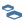 | bulb-group-ceiling-square |
|  | bulb-group-sultan-lightstrip-off |
|  | lightstrip-off |
| | bulb-group-sultan-spot |
| | bulb-group-sultan-spot-off |
| | bulb-classic-off |
| | bulb-spot-off |
| | bulb-sultan-off |
|  | bulb-group-ceiling-round |
|  | ceiling-still |
|  | ceiling-flourish |
|  | desk-lamp |
|  | double-spot |
|  | floor-lantern |
|  | floor-lantern-off |
| 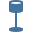 | floor-shade |
|  | floor-spot |
|  | pendant-long |
|  | pendant-long-up |
|  | pendant-round |
| 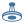 | pendant-being |
|  | pendant-cher |
|  | pendant-muscari |
|  | single-spot|
|  | table-shade | 
|  | wall-lantern |
|  | wall-shade |
|  | wall-spot |
|  | bulb-candle |
|  | bulb-flood |
|  | bulb-filament-candle |
|  | bulb-foh |
|  | bulb-general-group |
|  | bulb-group |
|  | bulb-group-filament-candle |
|  | bulb-group-filament-alt |
|  | bulb-group-filament-spot |
|  | bulb-group-filament-sultan |
|  | bulb-group-sultan-lightstrip |
|  | bulbs-classic |
|  | bulbs-filament |
|  | bulb-filament-alt |
|  | bulbs-spot |
|  | bulbs-sultan |
|  | bridges-v1 |
|  | bridges-v2 |
|  | dimmer-switch |
|  | friends-of-hue |
|  | friends-of-hue-eikon |
|  | friends-of-hue-arke |
|  | friends-of-hue-senic |
|  | friends-of-hue-arke-round |
|  | motion-sensor|
|   |  devices-plug | 
|   |  devices-tap | 
|   |  bloom |
|   |  go | 
|   |  go-off | 
|   |  go-group | 
|   |  play| 
|   |  play-bar-three| 
|   |  play-bar-v-alt| 
|   |  play-bar-v| 
|   |  play-bar-two| 
|   |  play-bar-v| 
|   |  play-bar-v-two-in| 
|   |  play-bar-v-two-out| 
|   |  play-bar-v-two| 
|   |  iris | 
|   |  light-strip | 
|  | recessed-floor |
|  | recessed-ceiling |
|   |  rooms-attic | 
|   |  rooms-balcony | 
|   |  rooms-bathroom | 
|   |  rooms-bedroom | 
|   |  rooms-carport | 
|   |  rooms-closet | 
|   |  rooms-computer | 
|   |  rooms-dining| 
|   |  rooms-driveway | 
|  |  rooms-gym | 
|   |  rooms-hallway | 
|   |  rooms-kitchen | 
|   |  rooms-living |
|   |  rooms-mancave | 
|   |  rooms-nursery | 
|   |  rooms-kids-bedroom |
|   |  rooms-office | 
|   |  rooms-other | 
|  | rooms-outdoor-social-time |
|  | rooms-pool |
|  | rooms-porch |
| | rooms-recreation |
| | rooms-staircase| 
|  | rooms-storage |
|  | rooms-outdoor |
|  | rooms-studio |
|  | rooms-terrace |
|  | rooms-toilet |
|  | amarant |
|  | amaze |
|  | amaze-alt |
|  | beyond |
|  | beyond-down |
|  | beyond-solid |
|  | beyond-up |
|  | button |
|  | centris |
|  | centris-two |
|  | centris-three |
|  | daylo-wall |
|  | lily-xl |
|  | lily |
|  | lily-two |
|  | pedestal |
|  | pillar-nyro |
|  | pillar-tuar |
|  | plug-eu |
|  | plug-uk |
|  | signe |
|  | signe-gradient-table |
|  | signe-gradient-floor |
|  | socket-uk |
|  | socket-eu |
|  | socket-us |
|  | wall-appear |
|  | wall-appear-group |
|  | wall-econic |
|  | wall-econic-lantern |
|  | wall-econic-lantern-base |
|  | wall-econic-lantern-top |
|  | wall-flood |
|  | wall-fuzo |
|  | wall-fuzo-h |
|  | wall-impress |
|  | wall-impress-narrow |
|  | wall-lucca |
|  | wall-nyro |
|  | wall-resonate |
|  | wall-tuar |
|  | wall-turaco |
|  | wall-lucca-alt-below |
|  | wall-lucca-alt |
|  | wellner |
|  | wellner-solid |
|  | wellness |
|  | lightstrip-tv-alt |
|  | lightstrip-tv |
|  | lightstrip-tv-off |
|  | lightstrip-wrap |
|  | pillar-spot |
|  | pillar-spot-double |
|  | adore |
|  | adore-alt |
|  | centura |
|  | centura-round |
|  | centura-two |
|  | bulb-group-centura |
|  | bulb-group-centura-round |
|  | bulb-group-lightstrip |
|  | bulb-group-lightstrip-v |
|  | liane |
|  | ceiling-explore |
|  | sync-box-alt |
|  | sync-box |
|  | ceiling-fugato-two |
|  | ceiling-fugato-three |
|  | ceiling-fugato-four |
|  | ceiling-fugato-two-alt |
|  | ceiling-fugato-three-alt |
| 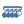 | ceiling-fugato-four-alt |
|  | ceiling-buratto |
|  | ceiling-buratto-two |
|  | ceiling-buratto-three |
|  | ceiling-buratto-four |
|  | ceiling-surimu |
|  | ceiling-aurelle |
|  | ceiling-infuse |
|  | ensis |
|  | ensis-up |
|  | flourish |
|  | flourish-alt |
|  | aura |
|  | gradient-tube-short |
|  | gradient-tube-long |
|  | bulb-par-38 |
|  | pillar-impress |
|  | pillar-impress-short |
|  | sana |
|  | sana-alt |
| | bulb-golfball-e14 |
| | bulb-group-golfball-e14 |
| | ceiling-buckram |
| | ceiling-buckram-two |
| | ceiling-buckram-three |
| | phoenix-semiflush |
| | phoenix-plafond |
| | phoenix-table |
| | phoenix-pendant |
| | ceiling-being |
| | friends-of-hue-flat-p |
| | friends-of-hue-flat-p-alt |
| | friends-of-hue-iq-flush |
| | friends-of-hue-iq-pendant |
| | friends-of-hue-retrotouch-black-chrome |
| | friends-of-hue-retrotouch-black-plain |
| | friends-of-hue-retrotouch-white-chrome |
| | friends-of-hue-retrotouch-white-plain |
| | wall-switch-module |
| | friends-of-hue-rigel |

---

## Hue made by @rchiileea
| Icon | Name |
|------|:--------------:|
| | bulb-sultan-group-v2 |
| | bulb-sultan-v2 |
| | hue-spot-group-v2 |
| | hue-spot-v2 |
| | ls-spot-iris-group-v2 |
| | ls-sultan-iris-group-v2 |


---

## Miscellany of icons

| Icon | Name |
|------|:--------------:|
| | roborock |
| | dome-light |
| | firetv |
| | prime-video |
| | amazon-logo |
| | smoke-detector |
| | nas |
| | nas-v2 |
| | spot-bulb-top |
| | light-string |
| | ceiling-fan |
| | ceiling-fan-light |
| | floor-lamp-dual |
|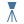 | floor-lamp |
| | ceiling-lamp |
| | ceiling-lamp-plafond |
| | ceiling-lamp-round |
| | chandelier |
| | ceiling-spot-lamp |
| | fronius-inverter-gen24 |
| | sprinkler |
|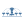 | garden-irrigation |
| | charging-station |
| | thermostat |
|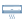 | air-conditioner |
| | nextcloud |
| | shelly-logo |
| | phoscon |
| | thermostat-v2 |
| | octoprint |
| | google-home-icon |
| | linktap |
| | tim-logo |
| | salt-lamp |
| | yamaha-rx-v773 |
| | dune-hd |
| | nvidia-shield |
 | herman-miller-aeron |
 | discovery-plus |
 | disney-plus |
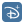 | disney-plus-alt|
 | shade-rchiileea-v1 |
 | shed-closed |
 | shed-open |
 | desktop-computer |
 | ha-blue |
 | intel-nuc |
 | proxmox |
 | raspberry-pi |
 | power-panel-logo |
 | iptvx |
 | netflix |
 | streamz |
 | videoland |
 | alexa-logo |
 | zigbee-dongle |
[Preview](./icon-svg/zwave-dongle.svg) | zwave-dongle|
 | wifi-dongle |
 | seagate-ssd-m2 |
 | seagate-ssd |
 | ram-memory |
 | intel-cpu |
 | jellyfin |
 | rituals |
 | telnet-box |
 | sky-q-logo |
 | tablet |
 | laptop |
 | laptop-windows |
 | litterbox|
 | outside-temp|
 | underfloor-heating|
 | asus-rp-68u|

---
## Sonoff device
| Icon | Name |
|------|:--------------:|
| | mini |
| | window-sensor |
| | bridge |
| | usb-smart-adaptor |
| | smart-plug-sonoff |
| | smart-camera |

---
## Moes device
| Icon | Name |
|------|:--------------:|
| | moes-switch-single |
| | moes-switch-dual |
| | moes-switch-triple |
---
## Modem/Router ISP
| Icon | Name |
|------|:--------------:|
| | nexxt |
| | fastgate |
---
## Meross device
| Icon | Name |
|------|:--------------:|
| | smart-plug-schuko |
| | double-smart-plug |
| | smart-power-strip |
| | smart-desk-lamp |
| | smart-plug-it |
| | temp-sensor |
| | triple-wall-switch |
| | double-wall-switch |
| | single-wall-switch |
| | smart-switch |
| | lamp-bedside-table |
| | lamp-bedside-table-2 |
| | wall-switch |
| | essential-oil-diffuser |
| | roller-shutter-switch |
---
## Battery status
| Icon | Name |
|------|:--------------:|
| | battery-charged |
| | battery-full |
| | battery-good |
| | battery-half |
| | battery-low |
| | battery-critical |
---
## Netgear device
| Icon | Name |
|------|:--------------:|
| | arlo-essential-indoor |
| | arlo-cam |
| | arlo-pro-3 |
| | arlo-ultra-2 |
| | arlo-q |
| | arlo-floodlight |
| | arlo-audio-doorbell |
| | arlo-video-doorbell |
| | arlo-security-light |
| | arlo-base-station |
| | arlo-baby |
| | orbi |
 | wifi-extender |
 | nighthawk |
---
## Alexa device
| Icon | Name |
|------|:--------------:|
| | echo-plus |
| | echo-gen-2 |
| | echo-dot-gen-3 |
| | echo-dot-gen-4 |
| | echo-spot |
| | echo-show-5-gen-2 |
| | echo-show-8-gen-2 |
| | echo-dot-gen-4-clock |
---
## Sonos device
Icons made by @rchiileea
| Icon | Name |
|------|:--------------:|
| | sonos-beam |
| | sonos-sub |
| | sonos-playbar |
| | sonos-bookshelf-vertical |
| | sonos-bookshelf-horizontal |
---
## Apple device
| Icon | Name |
|------|:--------------:|
| | apple-tv |
| | apple-airpods-pro |
| | apple-airpods |
| | apple-iphone |
| | apple-ipad-pro |
| | homepod |
| | homepod-mini |
| | apple-tv-box |
| | apple-watch |
| | apple-watch-alt |
| | imac |

---
## Blink Cameras
| Icon | Name |
|------|:--------------:|
| | xt2-camera |
| | sync-module |
| | mini-camera |

---
## Elgato
| Icon | Name |
|------|:--------------:|
| | elgato-key-light-air |
| | elgato-ring-light |
| | elgato-key-light |

---
## Google
| Icon | Name |
|------|:--------------:|
| | google-home |
| | home-max |
| | home-mini |
| | nest-wifi-router |
| | nest-wifi-repeater |
| | google-wifi-router |

 ---
## Window and Roller Shutter
Icons made by @rchiileea
| Icon | Name |
|------|:--------------:|
| | tilt-window-closed |
| | tilt-window-opened |
| | blind-tilt-open |
| | blind-tilt-closed |
| | double-window-open |
|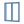 | double-window-closed |
| | lift-out-window-close |
| | lift-out-window-open |
| | sliding-window-door-close |
| | sliding-window-door-open |
| | top-window-closed |
| | top-window-open |
| | vert-blind-close |
|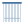 | vert-blind-open |

---
## Doors
Icons made by @rchiileea
| Icon | Name |
|------|:--------------:|
| | panel-glass-door-close |
| | panel-glass-door-open |
| | panel-glass-door2-close |
| | panel-glass-door2-open |
| | panel-glass-door3-close |
| | panel-glass-door3-open |
| | side-glassdoor-close |
| | side-glassdoor-open |
| | panel-frontdoor-open |
| | panel-frontdoor-close |
| | panel-glassdoor-close |
| | panel-glassdoor-open |
| | panel-door-open |
| | panel-door-close |
 | petflap-open |
 | petflap-closed |
---
## Ring
Icons made by @rchiileea
| Icon | Name |
|------|:--------------:|
| | ring-doorbell |
|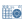 | ring-alarm-panel |
| | ring-alarm |
|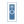 | ring-doorbell-pro |
| | ring-floodlight |
| | ring-spotlight-cam |
| | ring-stick-up-cam |
| | ring-smart-lighting |

---
## Christmas decorations
| Icon | Name |
|------|:--------------:|
| | christmas-lights |
| | christmas-wreath |
| | christmas-tree |
| | christmas-tree-v2 |

---
## Ikea
Icons made by @rchiileea
| Icon | Name |
|------|:--------------:|
| | ikea-blind-open |
| | ikea-blind-closed |
| | ikea-5-spot |

---
## Schneider Electric
Icons made by @rchiileea
| Icon | Name |
|------|:--------------:|
| | apc-ups-basic |
| | apc-ups-upright |
| | wiser-heating-ctl-off |
| | wiser-heating-ctl-on |
| | wiser-thermostat-off |
| | wiser-thermostat-on |

---
## Reolink
Icons made by @rchiileea
| Icon | Name |
|------|:--------------:|
| | reolink-510 |
| | reolink-811 |
| | reolink-820 |
| | reolink-842 |
| | reolink-argus |
| | reolink-go |

---
## Tesla
Icons made by @rchiileea
| Icon | Name |
|------|:--------------:|
| | tesla-icon |
| | model-x-charge |
| | model-x-open |
| | model-s-charge |
| | model-s-charge-side |
| | model-s |
| | model-s-side |

--- 
## Tp-Link
Icons made by @rchiileea
| Icon | Name |
|------|:--------------:|
| | tp-link-tapo |

---
## Ubiquiti
Icons made by @rchiileea
| Icon | Name |
|------|:--------------:|
| | ubiquiti |
| | ubiquiti-logo |
| | ubiquiti-ap |
| | ubiquiti-usg-p3 |

---
## Fritz
Icons made by @rchiileea
| Icon | Name |
|------|:--------------:|
| | fritzbox-7530 |
| | fritz-repeater |

# Install

## HACS

We recommend installing Custom brand icons card via [Home Assistant Community Store](https://hacs.xyz)
 
 1. Add the folowing to the `frontend` section of your `configuration.yaml`

  ```yaml
frontend:
  extra_module_url:
    - /local/community/custom-brand-icons/custom-brand-icons.js
```
2. (optional) Or add the following to your lovelace configuration using the Raw Config editor under Configure UI or ui-lovelace.yaml if using YAML mode.

```yaml
resources:
  - type: js
    url:  /local/community/custom-brand-icons/custom-brand-icons.js
```

 ##  Manual Installation

To add custom repositories please follow [this guide](https://hacs.xyz/docs/faq/custom_repositories/). Set URL to `https://github.com/elax46/custom-brand-icons` and category to `Lovelace`.
1. Download `custom-brand-icons.js` file from the [latest release](https://github.com/elax46/custom-brand-icons/releases/latest).
2. Copy the `custom-brand-icons.js` file into `<config>/www/` the directory where your `configuration.yaml` resides.

3. Add the folowing to the `frontend` section of your `configuration.yaml`

```yaml
frontend:
  extra_module_url:
    - /local/custom-brand-icons.js
```

Or add the following to your lovelace configuration using the Raw Config editor under Configure UI or ui-lovelace.yaml if using YAML mode.

```yaml
resources:
  - type: js
    url: /local/custom-brand-icons.js
```

Restart home-assistant.

## Use
you can use icons by entering the prefix `phu:`

Example of integration in the card

```yaml
entities:
  - entity: light.lampada_entrance
    icon: 'phu:go'
    name: Go
  - entity: light.monitor_2_right
    icon: 'phu:play'
    name: play 1
  - entity: light.monitor_2_left
    icon: 'phu:play'
    name: play 2
show_header_toggle: false
title: Custom brand icons
type: entities
```
# Help me insert more icons!

***Attention I remind you that the icons must be in svg format***

If you want, you can help me expand the number of icons available. Just add the following string to the `var icons` variable of the` custom-brand-icons.js` file

let's take the first string for example:

```js
"Bollard": [0, 0, 24.0, 24.0, "string"]
```
* `Bollard` = icon name

* `0, 0, 24.0, 24.0` = this data can be recovered from the svg file `viewBox="0 0 24 24"` ***If this data is not present in the file you can leave the one indicated by me***

* `String` = this data can be recovered from the svg file  `<path d="M21,12.5 C21,13.33 18.76,...."` In particular you will have to enter only the part of the vector code `"M21,12.5 C21,13.33 18.76"` For an example take a look at the [icons already inserted](dist/custom-brand-icons.js)

# Don't see the icon?

It probably depends on the cache. Open Home assistant from an incognito window and check that the icon loads if yes then it depends on the cache, otherwise double check the installation

# Make icon
To make an icon in svg format you can use different programs starting from illustrator or inkview. The size of the icons must be 24x24 and the svg code must not contain transform, translate, scale but only viewbox

# Icon Requests?

The icon is not there? open a [custom icon request](https://github.com/elax46/custom-brand-icons/issues/new?assignees=elax46&labels=icon-request&template=insertion-of-new-icons.md&title=Custom+Icon+request)  _The icons to integrate must be in svg format_

# Customize the prefix

In case you want to create your own perfix you can edit the last line of the `custom-brand-icons.js`

```js
  window.customIconsets["yourprefix"] = getIcon;
```

# Thanks
thanks to for @mutzl your contribution
# Support the project
Do you like these icons? Support the project with a pizza 🍕🍕

[](https://www.buymeacoffee.com/elax46)

### Stargazers
[](https://github.com/elax46/custom-brand-icons/stargazers)
